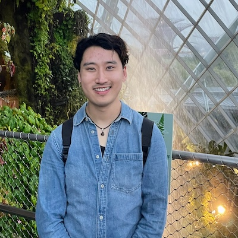

+++
date = '2024-12-02T04:05:12-07:00'
draft = false
title = 'Home'
+++

# Timothy Wang

**Utah Email:** u1509788@utah.edu

**Personal Email:** timothyswang99@gmail.com

**Advisor:** Professor R. Michael Young

**Biography:**
I am currently a first year Ph.D. student with Professor R. Michael Young at the University of Utah. I'm studying the intersection of computer science (especially AI) and storytelling in order to develop a more complex and nuanced computational model of narratives. My current research is looking at how to improve planning models as an approach to a computational model of narratives, incorporating more complex narrative concepts such as character arcs and story structure.

**Publications:**
- Wang, T.S., Gordon, A.S. (2023). Playing Story Creation Games with Large Language Models: Experiments with GPT-3.5. In: Holloway-Attaway, L., Murray, J.T. (eds) Interactive Storytelling. ICIDS 2023. Lecture Notes in Computer Science, vol 14384. Springer, Cham. https://doi.org/10.1007/978-3-031-47658-7_28
- Gordon, A.S., Wang, T.S. (2021). Narrative Text Generation from Abductive Interpretations Using Axiom-Specific Templates. In: Mitchell, A., Vosmeer, M. (eds) Interactive Storytelling. ICIDS 2021. Lecture Notes in Computer Science(), vol 13138. Springer, Cham. https://doi.org/10.1007/978-3-030-92300-6_7
- Rueben, M., Syed, M., London, E., Camarena, M., Shin, E., Zhang, Y., ... & Matarić, M. J. (Including Timothy S. Wang) (2021, October). Long-term, in-the-wild study of feedback about speech intelligibility for k-12 students attending class via a telepresence robot. In Proceedings of the 2021 International Conference on Multimodal Interaction (pp. 567-576).

**Education Background:**
- University of Southern California: MS Computer Science (2023)
- University of Southern California: BS Computer Science (2022)

**LinkedIn Profile:**
https://www.linkedin.com/in/timothyswang99/

**CV:**
[Click Here](files/WangTimothyCV.pdf)